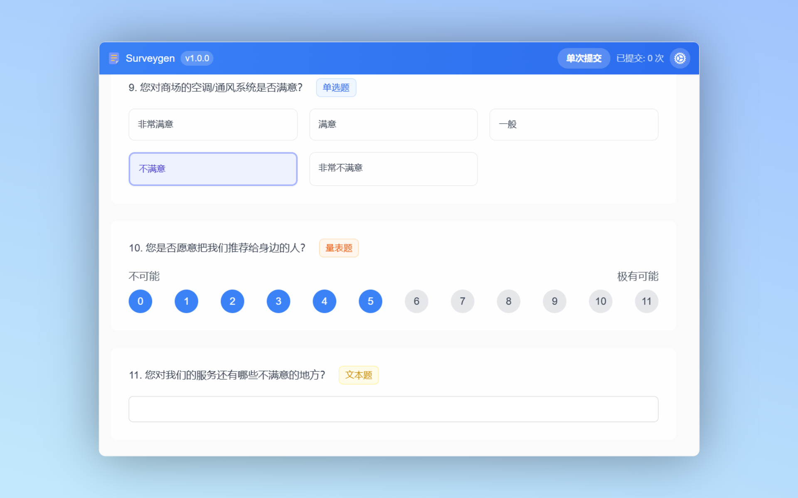

# SurveyGen

  <b>问卷星自动答题助手</b>

  
  
  

  

## 🎯 核心功能

这个脚本可以帮助你在问卷星全自动答题，并且绕过问卷星的复制限制。

## 📋 支持的问题类型

- 单选题
- 多选题
- 矩阵单选题
- 矩阵多选题
- 文本题
- 下拉选择题
- 量表题

## 📦 安装

1. 安装浏览器扩展 [Tampermonkey](https://www.tampermonkey.net/)
2. 前往 [Greasy Fork](https://greasyfork.org/zh-CN/scripts/568432) 点击「安装此脚本」

或者从 [GitHub Releases](https://github.com/PeanutSplash/Surveygen/releases/latest) 下载最新版本手动安装。

## 📱 使用教程

### 方法一：通过页面预设答案

1. 在问卷页面中，首先手动填写所有问题的正确答案。
2. 将页面滑动到最底部。
3. 点击"提交为标准答案"按钮。
4. 之后，你可以选择"自动提交"（如果需要多次提交）或"单次提交"。

### 方法二：通过悬浮窗选择答案

1. 打开问卷页面后，脚本的悬浮窗会自动出现。
2. 在悬浮窗内，为每个问题选择或填写相应的答案。
3. 提交方式同上。

## 🔧 技术栈

- **前端框架**: Vue 3.4.27
- **构建工具**: Vite 5.2.12
- **开发语言**: TypeScript 5.4.5
- **状态管理**: Pinia 2.2.2
- **UI框架**: TailwindCSS 3.4.11

## 📝 许可证

[Apache-2.0](https://github.com/PeanutSplash/Surveygen?tab=Apache-2.0-1-ov-file)

## 🤝 贡献指南

欢迎提交 Issue 或 Pull Request 来帮助改进项目。

## ✨ 后续功能

- **支持AI作答**: 智能理解问题内容，自动生成合适的答案。
